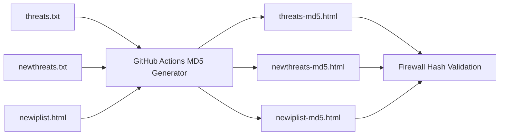
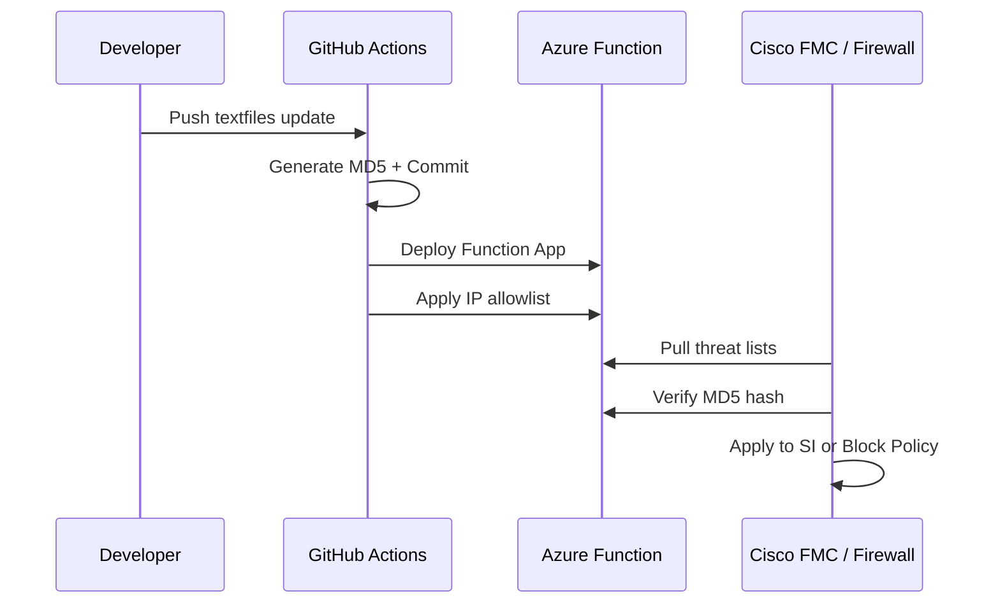

# 🛡️ Azure Function Threat List Automation

This project provides a secure, automated way to host IP threat lists via an **Azure Functions** endpoint and deploy them through **GitHub Actions**, including automatic MD5 hash generation, IP access control, and native compatibility with **Cisco Secure Firewall Management Center (FMC)**.  

This setup enables organizations to feed IP threat data directly into firewall policies such as **Security Intelligence (SI)** or block policies.

---

## 📜 Overview

- Serves `.txt` and `.html` threat list files securely.  
- Auto-generates and overwrites MD5 hash files for integrity checks.  
- Enforces IP allowlists during deployment.  
- Supports Cisco FMC External Block List integrations.  
- Automatically manages temporary GitHub runner IP access during deploy.  
- Ensures threat lists can be used in **SI** or **block policy** enforcement.

---

## 📂 Project Structure

Threat list Example Structure
```
textfiles/
├── newiplist.html
├── newiplist-md5.html
├── newthreats.txt
├── newthreats-md5.html
├── threats.txt
└── threats-md5.html
```
Threat list File Examples
| File | Type | Purpose |
|------|------|----------|
| `threats.txt` | TXT | Primary IP threat list |
| `threats-md5.html` | HTML | MD5 hash verification for threats.txt |
| `newthreats.txt` | TXT | Secondary threat list |
| `newiplist.html` | HTML | Formatted list (human readable) |

---

## 🧰 Setup Instructions

1. **Clone Repository**
   ```bash
   git clone https://github.com/<your-org>/<your-repo>.git
   cd <your-repo>
   ```

2. **Add Threat Files** to `textfiles/` (e.g., `threats.txt`, `newthreats.txt`, `newiplist.html`).

3. **Optional:** Add `accessWhitelist.txt`
   ```txt
   122.35.24.27 # Security Team
   192.168.10.0/24 # Office Network
   203.0.113.55 # SOC
   ```

4. **Configure GitHub Secrets**:
   ```
   AZUREAPPSERVICE_CLIENTID
   AZUREAPPSERVICE_TENANTID
   AZUREAPPSERVICE_SUBSCRIPTIONID
   AZUREAPPSERVICE_RESOURCEGROUP
   ```

5. **Push to Main** — GitHub Actions will automatically build, whitelist, hash, and deploy.


## 🏗️ Deployment Pipeline

- ✅ Regenerate and overwrite MD5 files for all `.txt` and `.html`.  
- ✅ Commit updated MD5 files.  
- ✅ Enforce IP allowlist from `accessWhitelist.txt`.  
- ✅ Temporarily allow GitHub runner IPs.  
- ✅ Deploy to Azure Function App.  
- ✅ Clean up temporary IP rules.

---

## 🌐 API Endpoints

Example url for threat list
```
GET https://<your-function>.azurewebsites.net/api/getThreatList?filename=<file>
```

Examples:
```
https://appwebtest.azurewebsites.net/api/getThreatList?filename=threats.txt
https://appwebtest.azurewebsites.net/api/getThreatList?filename=threats-md5.html
```

---

## 🔥 Cisco FMC Integration

1. Go to  
   `Objects → Object Management → External Block Lists`  
2. Add External Block List:
   - **Name:** Threats-Primary  
   - **Type:** IP  
   - **URL:**
     ```
     https://<app>.azurewebsites.net/api/getThreatList?filename=threats.html
     ```
   - **Verify MD5 URL:**
     ```
     https://<app>.azurewebsites.net/api/getThreatList?filename=threats-md5.html
     ```
   - **Refresh Interval:** e.g., 30 min
3. Add the object to your **SI (Security Intelligence)** or **Block Policy**.

✅ Cisco FMC will:
- Periodically pull the threat list
- Verify it with the corresponding MD5 hash file
- Enforce it in your access control policy

---

## 🧮 MD5 Hash Workflow



---

## 🛡️ Access Control

- IPs from `accessWhitelist.txt` are automatically enforced.  
- Temporary GitHub runner IPs are added for deployment and removed afterward.  
- IP rule priorities are assigned dynamically (500–2000).  
- Duplicate IPs are skipped gracefully.  
- Supports both single IPs and CIDR ranges.
- **Remove 8.8.8.8 Example in "accessWhitelist.txt

---

## 🧭 End-to-End Flow



---

## 📌 Best Practices

- Keep lists in `.txt` format for easy integration.  
- Always use MD5 verification in FMC configuration.  
- Maintain your allowlist for controlled access.  
- Use separate lists for different threat types.  
- Integrate with SI/block policies for active enforcement.  
- Review logs and Azure Function access regularly.

---

✅ **Result:**  
You now have a **fully automated, secure threat feed** pipeline, integrating GitHub, Azure Functions, and Cisco FMC. Threat lists are version-controlled, hash-verified, access-restricted, and automatically enforced in your security policies.
